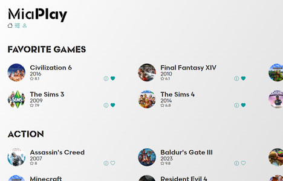
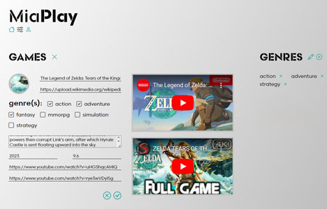

Essa página está em  Português.
To view this page in  English, [click here](./README.md).

---

#  MiaPlay

Aplicação onde você pode realizar operações CRUD (criar, ler, atualizar, excluir) em gêneros e jogos, marcar jogos como favoritos e listar os jogos por gênero, com os favoritos no topo.

## 🔗 Demo

- [miaplay.vercel.app](https://miaplay.vercel.app/)

## 🖼️ Screenshots

## &nbsp; Backend

- [MiaPlay-server](https://github.com/miaslls/MiaPlay-server#readme)

## 👩‍💻 Autoria

- [@miaslls](https://www.github.com/miaslls)

## 🫶 Recursos / Agradecimentos

- [Bootstrap](https://icons.getbootstrap.com/)
